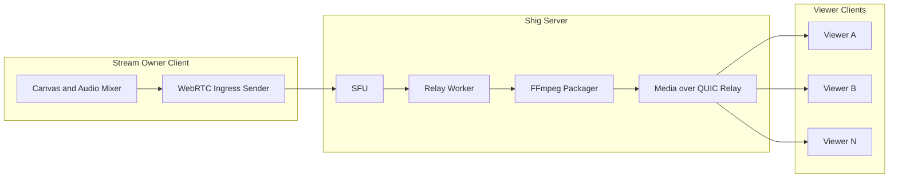

# Relay Architecture

This document describes the livestream egress path from the mixed client stream to multiple viewers.

## Overview

The stream owner mixes local and guest media into one composed stream on the client side. This mixed stream is sent to the SFU via WebRTC ingress.

The SFU forwards the stream media into the relay pipeline. The relay pipeline packages the media as fragmented MP4/CMAF and publishes it over Media over QUIC. Viewers subscribe to the published stream through the relay.

Current viewer playback latency target:

```text
750 ms
```

## Components



## Stream Owner Path

The stream owner creates a mixed stream in the client:

- video is rendered into a canvas mixer
- audio is mixed through the Web Audio graph
- the resulting MediaStream is sent as the livestream source

The mixed stream enters Shig through WebRTC:

```text
Client Mixer -> WebRTC Ingress -> SFU
```

## SFU to Relay

The SFU receives the WebRTC media tracks and exposes them to the relay worker.

The relay worker forwards RTP packets to FFmpeg over local UDP sockets:

```text
SFU RTP -> Relay Worker -> UDP localhost -> FFmpeg
```

FFmpeg packages the incoming media into fragmented MP4/CMAF:

```text
H.264 video copy
Opus audio -> AAC
fMP4 / CMAF fragments
```

The current fragment duration is approximately:

```text
250 ms
```

## Media over QUIC Publishing

After FFmpeg creates CMAF fragments, the relay publishes them as Media over QUIC groups.

Viewers do not connect to the SFU directly for livestream playback. They connect to the relay:

```text
Viewer -> Media over QUIC Relay -> live stream groups
```

Multiple viewers can subscribe to the same published stream.

## Viewer Playback

The web client uses the MoQ player with a current playback latency target of 750 ms.
This value gives the player enough buffer to avoid frequent late group skips while keeping the stream close to live.

Lower values reduce latency but make playback more sensitive to:

- network jitter
- QUIC scheduling
- browser scheduling
- decode timing
- fragment arrival timing

