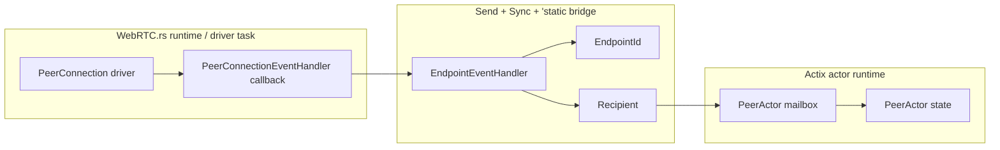
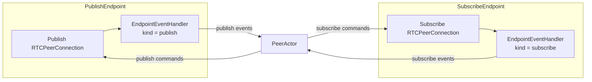

# RTC Event Synchronization

This document explains the synchronization boundary used by the RTC endpoint event handler.

## Context

WebRTC.rs owns the peer connection driver. The driver can emit events from async runtime tasks that are not the same task or actor context that created the endpoint.

For that reason, WebRTC.rs requires the event handler to be safe to share across async tasks:

```rust
#[async_trait::async_trait]
pub trait PeerConnectionEventHandler: Send + Sync + 'static
```

The Shig RTC layer implements this with `EndpointEventHandler`.

## What `Send + Sync + 'static` Means Here

`Send` means the handler may be moved to another runtime task or thread.

`Sync` means references to the handler may be shared safely between tasks or threads.

`'static` means the handler must not borrow temporary actor state. The WebRTC.rs driver may keep the handler for the full lifetime of the peer connection, so the handler must own everything it needs.

This does not mean that the whole `PeerActor` is shared between threads. The actor still owns its state. Only a small, thread-safe event bridge is shared with WebRTC.rs.

## Event Bridge

The handler stores only stable identity and an Actix recipient:

```rust
pub struct EndpointEventHandler {
    endpoint_id: EndpointId,
    event_sink: Recipient<EndpointEvent>,
}
```

`EndpointId` identifies the endpoint that produced the event.

`Recipient<EndpointEvent>` is the actor mailbox target. It lets the WebRTC.rs callback send a typed event back into the actor system without directly touching actor state.

The event flow is:

```text
WebRTC.rs driver
-> EndpointEventHandler callback
-> EndpointEvent
-> PeerActor mailbox
-> PeerActor mutates its own state
```



## Why The Handler Does Not Mutate Peer State

The handler must be `Sync`, but `PeerActor` state is intentionally actor-local. Mixing those two models would make ownership unclear and invite locking around actor state.

Instead, the handler is deliberately small. It only forwards events:

```text
on_track(track)
-> EndpointEvent::Track { endpoint_id, track }
```

The `PeerActor` receives the event later in its normal mailbox order and decides what to do.

## Publish And Subscribe Endpoints

Both endpoint types can use the same handler because the handler does not contain publish-specific or subscribe-specific business logic. The endpoint kind is part of `EndpointId`.

The peer can branch on the event:

```text
EndpointKind::Publish
-> incoming tracks are expected
-> incoming data channels are expected

EndpointKind::Subscribe
-> negotiation events are expected
-> remote-created data channels and inbound tracks are unexpected unless explicitly supported
```

This keeps the synchronization layer shared and the endpoint behavior explicit.



## Design Rule

The RTC event handler is a bridge, not an owner.

It may cross async/thread boundaries, so it must be `Send + Sync + 'static`. It should not hold mutable SFU state. Mutable state stays in the owning actor, normally the `PeerActor`.
