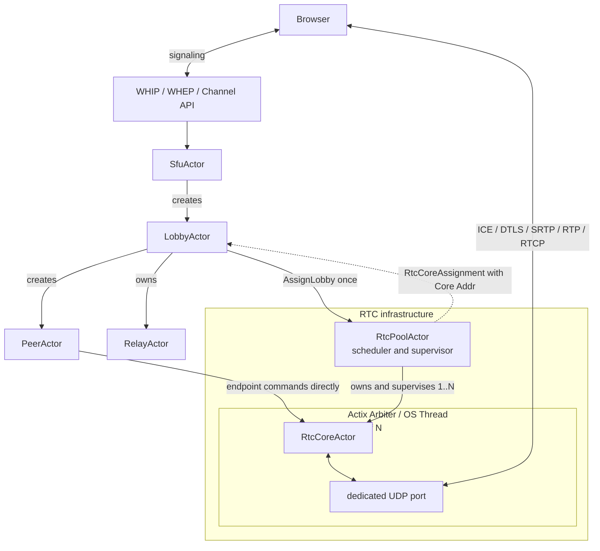
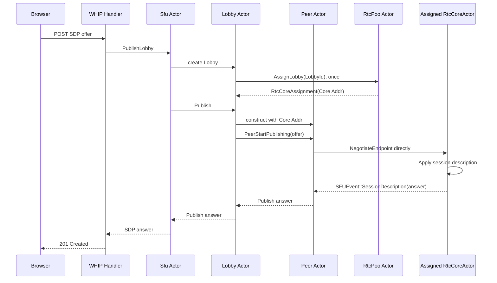

# RTC Architecture

Shig uses a multi-core RTC media plane while retaining the existing
Actix actor hierarchy for application state, channel membership, authorization, and
subscription decisions.

The central design rule is that control messages travel through Actix mailboxes, while RTP
and RTCP packets stay inside the media plane. This avoids routing every media packet through
the `Sfu`, `Lobby`, and `Peer` actor mailboxes.

## Target Architecture



The pool-to-core relationship is hierarchical: one `RtcPoolActor` owns and supervises one or
more `RtcCoreActor` instances. With dedicated threads enabled, every core sits inside its own
Actix Arbiter and OS thread and owns one UDP port. A core does not own the pool, and a lobby does
not own a core; the lobby only retains the assigned core address for direct peer communication.

The existing actors remain the control plane:

- `Sfu` manages lobbies and global lifecycle.
- `Lobby` represents a channel and owns its subscription policy.
- Every `Lobby` owns one `RelayActor` and controls its lifecycle. The relay's future media-input
  interface is intentionally left open until the endpoint-based RTC output is defined.
- After publish negotiation, `Peer` emits `PeerStartedSending`. The `Lobby` forwards the publish
  `EndpointId` to its `RelayActor` as a relay source; leaving peers detach that source again.
- `Peer` represents one logical participant.
- `DbActor` persists lobby and participant state.
- `RtcPoolActor` assigns each lobby to one media core for its entire lifetime.
- Each `RtcCoreActor` exclusively owns and drives its RTC endpoint state and protocol components.
- With dedicated threads enabled, every core runs on its own Actix Arbiter and OS thread.

The first scaling boundary is the lobby: all endpoints and forwarding state belonging to one
lobby stay on the same core. This avoids cross-thread RTP forwarding and makes ICE, DTLS,
SRTP, SSRC/MID mapping, and RTCP feedback local to one state machine. Reassigning an active
lobby to another core is intentionally not supported.

The theoretical CPU, packet-rate and multi-core scaling model is documented in
[SFU Performance Model](performance.md).

A logical peer continues to use two WebRTC connections. The publish endpoint receives the
participant's media, while the subscribe endpoint sends selected remote media back to that
participant. Each connection receives its own endpoint ID; neither endpoint ID replaces the
logical participant ID.

```text
Participant
|- Publish endpoint   (WHIP / sendonly)
`- Subscribe endpoint (WHEP / recvonly)
```

## Publish Setup Flow



WHEP keeps the existing two-step API: `POST` creates and returns the SFU offer for the peer's
subscribe endpoint, then `PATCH` applies the browser's SDP answer. This public signaling contract
does not depend on the internal RTC-core implementation.

## Identity and Routing Model

The architecture uses explicit identities for participants, WebRTC connections, and channels:

```rust
struct EndpointId {
    lobby_id: LobbyId,
    peer_id: PeerId,
    kind: EndpointKind,
}
```

`EndpointId` is a domain identity and deliberately contains neither a Sans-I/O `RoomId` nor a
numeric `ClientId`. Publish and subscribe endpoints are derived deterministically from their
lobby, peer, and endpoint kind. Neither `Peer` nor `Lobby` stores or allocates numeric Sans-I/O
client IDs.

The current implicit "all media except the peer's own media" routing is replaced by an
explicit subscription graph:

```text
(channel, publisher endpoint, MID) -> set of subscriber endpoints
```

This allows channel policy to decide whether a participant receives every published track,
only selected tracks, or also a loopback of their own published media.

## Core Assignment and Actor Boundary

The `LobbyActor` asks `RtcPoolActor` for a core exactly once. The pool returns an
`RtcCoreAssignment` containing the selected `RtcCoreActor` address. The lobby passes that address
to every peer it creates. After that assignment, peers send endpoint commands directly to the
core. The pool is not part of their signaling path. Endpoint commands include:

- create or remove a publish/subscribe endpoint;
- apply an SDP description or ICE update;
- subscribe or unsubscribe an endpoint from a published track;
- close all endpoints belonging to a channel or participant.

The pool only starts and stops cores, owns their ports and threads, tracks load, and maintains the
stable `LobbyId -> RtcCoreActor` assignment. UDP datagrams, SDP endpoint commands, RTP, and RTCP
do not pass through the pool.

Each core binds its own UDP port. Assigning a lobby before its first SDP exchange determines
the media port advertised to every endpoint in that lobby. This removes the need for a central
UDP dispatcher and lets the operating system process core sockets in parallel.

## Configuration

```toml
[sfu]
bind_ip = "0.0.0.0"
advertised_ip = "203.0.113.10"
cores = 4
base_port = 50000
dedicated_threads = true
assignment = "least_loaded"
```

`cores = 0` selects the available OS parallelism. Core 0 binds `base_port`; every following
core binds the next consecutive UDP port. The configuration is rejected if the resulting port
block exceeds port 65535.
`least_loaded` assigns a new lobby to the core with the fewest lobbies; `round_robin` is
available for deterministic rotation. Assignment stays unchanged until the lobby stops.
