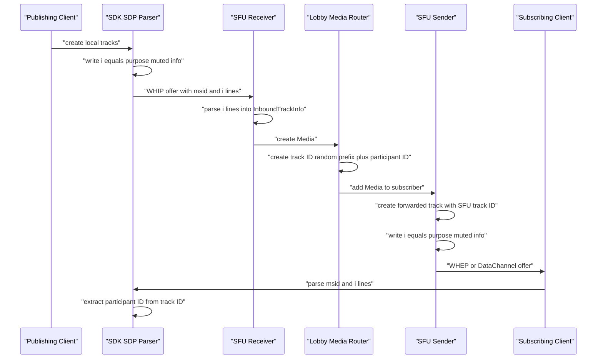

# Signaling Metadata

Shig uses a small SDP metadata contract between the client SDK and the SFU. This
metadata is required so a subscriber can map remote tracks back to the publishing
participant and understand what kind of media each track represents.

There are two metadata carriers:

- the forwarded track ID, which contains the publishing participant ID
- the media-line `i=` field, which contains Shig-specific track metadata

## Forwarded Track ID

Every track a participant subscribes from the SFU receives an SFU-generated track
ID. The track ID is not the original browser track ID. It is generated by the SFU
when an inbound publisher track becomes lobby media.

```text
<random-prefix>-<participant-id>
```

Example:

```text
a8K3pQ-3c734426-bc94-4a38-8ffd-dd2a46c056de
```

The random prefix prevents multiple tracks from the same participant from sharing
the same track ID. The participant ID lets the SDK recover the publishing peer
from the subscribed track.

Current implementation notes:

- The legacy SFU implementation generates the prefix with `random_id(6)`.
- The endpoint-based MediaEngine implementation uses an endpoint-derived prefix
  and stores the participant ID on the `RtcEndpoint`.
- The SDK does not depend on the prefix length. It extracts the participant ID
  by finding the UUID inside the track ID.
- If the intended public contract is a five-character prefix, the SFU
  implementation should be changed to generate `random_id(5)`.

SDK extraction:

```ts
const UUID_REGEX =
  /[0-9a-fA-F]{8}-[0-9a-fA-F]{4}-[1-5][0-9a-fA-F]{3}-[89abAB][0-9a-fA-F]{3}-[0-9a-fA-F]{12}/;
```

The SDK calls `extractPeerId(trackId)` and returns the first UUID found in the
track ID. If no UUID is found, it falls back to the full track ID.

## SDP Media Line Info

Shig stores per-track metadata in the SDP media-line info field. In SDP this is
the `i=` line inside an `m=audio` or `m=video` section.

```text
i=<purpose> <muted> <info>
```

Example:

```text
m=video ...
a=mid:1
a=msid:camera-stream a8K3pQ-3c734426-bc94-4a38-8ffd-dd2a46c056de
i=1 2 Guest
```

The SDK writes this metadata by setting `m.description` through `sdp-transform`.
The SFU writes the same metadata by setting `media_title` on the media
description. Both serialize to the SDP `i=` field.

## Purpose

The first value describes why the media exists.

| Value | SDK name | SFU legacy name | Meaning |
| --- | --- | --- | --- |
| `1` | `LobbyMediaPurpose.GUEST` | `MediaPurpose::PARTICIPANT` | Normal participant media such as camera or microphone. |
| `2` | `LobbyMediaPurpose.STREAM` | `MediaPurpose::STREAM` | Stream media, for example the composed live-stream video or audio. |

Unknown or missing values default to participant media.

## Muted

The second value describes the mute state known at offer creation time.

| Value | Meaning |
| --- | --- |
| `1` | muted |
| `2` | not muted |

The SDK writes this from `track.enabled` when creating a publish offer:

```text
muted = !track.enabled
```

Later mute updates are signaled over the Control DataChannel and use the media
line `mid` as the sender-side identifier.

## Info

The third value is an application-defined string. The SDK currently uses it as
display metadata, for example the participant label shown in the lobby.

```text
i=1 2 Guest
i=2 2 Livestream
```

Current parser behavior:

- The legacy SFU parser uses `splitn(3, ' ')`, so it can preserve spaces in the
  info part.
- The current SDK parser uses `description.split(' ')` and reads `dataArray[2]`,
  so SDK-side info values should not contain spaces unless the parser is changed.

## End To End Metadata Flow



## Client Interpretation

When the SDK receives a remote SDP offer, it parses every non-application media
line into an `SdpMediaLine`:

```ts
{
  mid,
  trackId,
  streamId,
  kind,
  direction,
  purpose,
  muted,
  info,
  ssrcs
}
```

The important mapping is:

- `trackId` comes from the SDP `a=msid` track component
- `streamId` comes from the SDP `a=msid` stream component
- `peerId` is extracted from `trackId`
- `purpose`, `muted`, and `info` come from the SDP `i=` line

The SDK stores this metadata before applying the remote offer. Later, when
`ontrack` fires, it uses the transceiver `mid` to attach the actual
`MediaStreamTrack` to the metadata that was parsed from SDP.

## Compatibility Rules

- Forwarded track IDs must contain the publishing participant UUID.
- The random prefix may change length as long as the participant UUID remains
  present and parseable.
- Each media line that represents Shig media should include `i=<purpose> <muted> <info>`.
- The `application` media line for the DataChannel does not carry Shig track metadata.
- `info` should currently be treated as a single token for SDK compatibility.
