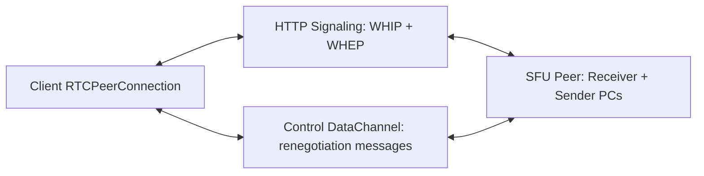
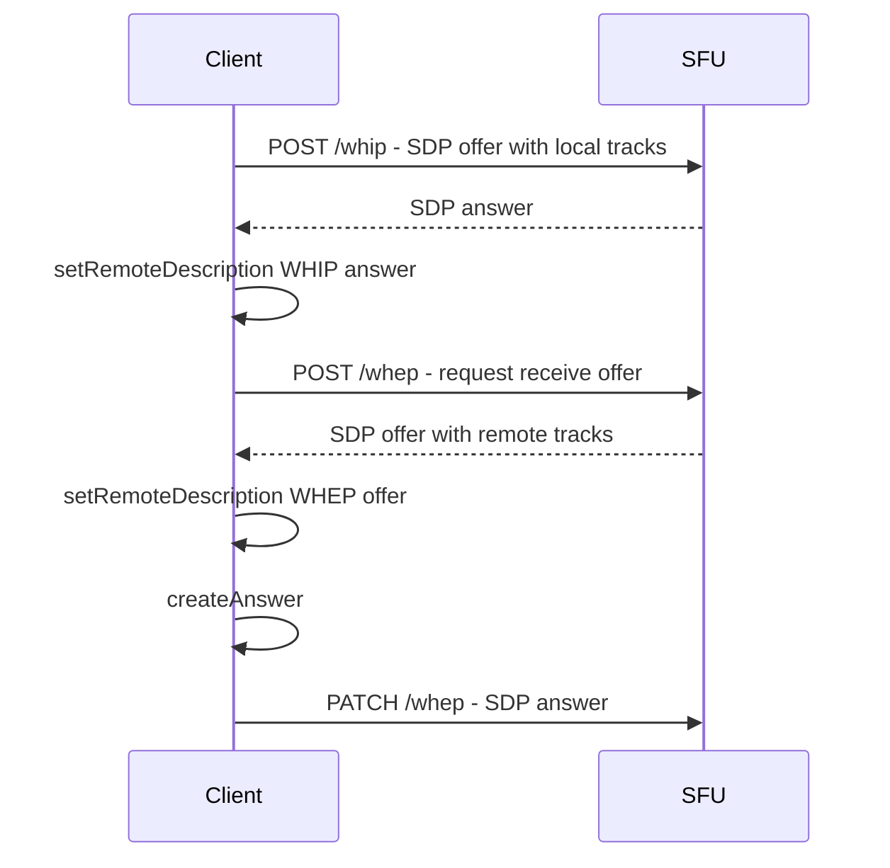
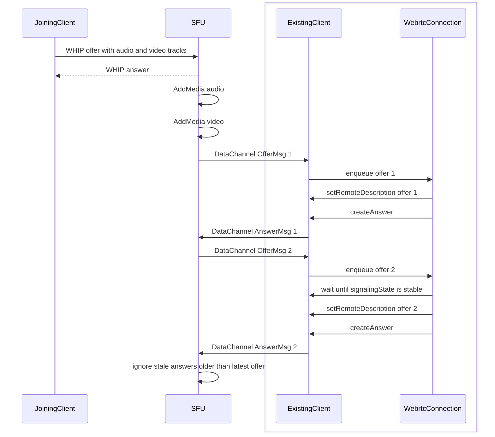

# Signaling

This document describes how a Shig client negotiates WebRTC sessions with the SFU.

In this document, `client` means any Shig client implementation: browser, native app, bot, or another WebRTC-capable integration.

The initial connection uses WHIP and WHEP over HTTP. Later media changes are signaled over the Control DataChannel.
The SDP metadata contract used by these flows is documented in
[Signaling Metadata](signaling-metadata.md).

## Roles



WHIP is used for ingress: the client sends local media to the SFU.

WHEP is used for egress: the client receives remote media from the SFU.

The Control DataChannel is used after the initial setup. It carries SFU-driven renegotiation offers and client answers when tracks are added or removed.

## Responsibilities

- The SFU creates a new offer when remote media changes for an already connected client.
- The client answers SFU offers over the Control DataChannel.
- The client serializes incoming DataChannel offers before applying them.
- The SFU ignores stale answers by comparing the answer number with the latest offer number.
- Glare is not expected in the normal SFU signaling path because renegotiation is SFU-owned.

## Initial WHIP / WHEP Flow



After this flow, the client has:

- an ingress peer connection for local media sent to the SFU
- an egress peer connection for remote media received from the SFU
- a Control DataChannel for later signaling messages

## DataChannel Renegotiation Flow



`ExistingClient` and `WebrtcConnection` are part of the same client implementation.

The client queues incoming offers because audio and video can produce closely spaced `AddMedia` events. The queue prevents overlapping `setRemoteDescription` calls.

## Message Shape

```text
OfferMsg {
  number: u64,
  sdp: string
}

AnswerMsg {
  number: u64,
  sdp: string
}
```

The `number` field binds each answer to the SFU offer that created it.
