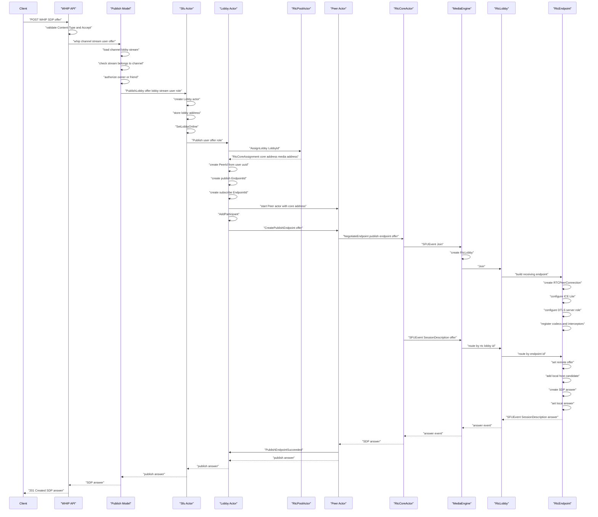

# Create Publishing Endpoint

This use case documents a participant creating a publishing endpoint with a WHIP
publish request. If no runtime lobby exists yet, the request creates the
control-plane lobby, assigns it to an RTC core, creates the publishing peer, and
builds the receiving RTC endpoint.

The browser or SDK creates the SDP offer. The offer contains the media the user
wants to publish and the initial DataChannel setup. Shig answers that offer over
HTTP. ICE, DTLS, SRTP, RTP, RTCP, and DataChannel traffic continue afterwards on
the assigned RTC UDP port.

## Scope

This case covers one participant's WHIP publish request:

- the participant does not exist yet
- the publish endpoint does not exist yet
- no subscribe endpoint is negotiated yet
- no other participant receives forwarded media yet

## Public Request

```http
POST /{channel_uuid}/stream/{stream_uuid}/whip
Content-Type: application/sdp
Accept: application/sdp

v=0
...
```

The request is handled by `create_answer` in `src/api/user/whip.rs`. The body is
the SDP offer. The successful response is:

```http
HTTP/1.1 201 Created
Content-Type: application/sdp

v=0
...
```

The response body is the SDP answer created by the assigned RTC endpoint.

## End To End Flow



## Control Plane Messages

The synchronous HTTP request crosses these actor messages:

| Step | Message | Purpose |
| --- | --- | --- |
| 1 | `PublishLobby` | Enter the SFU with the authorized user, lobby id, stream id, role, and SDP offer. |
| 2 | `AssignLobby` | Assign the new lobby to one stable RTC core. |
| 3 | `Publish` | Tell the lobby that a participant wants to publish media. |
| 4 | `CreatePublishEndpoint` | Ask the peer actor to negotiate its publish endpoint. |
| 5 | `NegotiateEndpoint` | Cross from the actor control plane into the endpoint-based RTC media plane. |
| 6 | `PublishEndpointSucceeded` | Notify the lobby after publish negotiation succeeded. |

`SetLobbyOnline` and `AddParticipant` are side effects sent to the database actor.

## RTC Events

Inside the RTC core, endpoint negotiation is represented as `SFUEvent`s:

| Event | Direction | Effect |
| --- | --- | --- |
| `SFUEvent::Join` | control plane to `MediaEngine` | Create the `RtcLobby` if it does not exist and add the new `RtcEndpoint`. |
| `SFUEvent::SessionDescription` with offer | control plane to endpoint | Apply the remote SDP offer from the client. |
| local host candidate | endpoint internal | Add the RTC core media address as a host candidate. |
| `create_answer` | endpoint internal | Create the SDP answer for the client offer. |
| `SFUEvent::SessionDescription` with answer | endpoint to control plane | Return the SDP answer that becomes the HTTP response body. |

The DataChannel is negotiated as part of the SDP offer and answer. The actual
DataChannel open event happens later, after ICE and DTLS have connected, so it is
not part of the HTTP response itself.

## Resulting State

After the response has been sent:

- `Sfu` has a `Lobby` actor stored for the lobby UUID.
- The database actor has been asked to mark the lobby online.
- The lobby has a stable `RtcCoreAssignment`.
- The lobby owns one `Peer` actor for the participant.
- The peer owns two domain endpoint IDs: one publish endpoint and one subscribe endpoint.
- The publish endpoint exists in the assigned `MediaEngine` as an `RtcEndpoint`.
- The RTC endpoint has answered the client's first offer and is ready for ICE, DTLS, SRTP, RTP, RTCP, and DataChannel traffic.

No relay endpoint is created in this flow. Relay creation is triggered by a
separate request and is documented as its own use case.

## Implementation Note

The actor boundary already exists as `NegotiateEndpoint`. The target endpoint-based
media flow is the one described above: `NegotiateEndpoint` should translate the
domain `EndpointId` into RTC identifiers, apply `SFUEvent::Join`, apply the SDP
offer as `SFUEvent::SessionDescription`, drain the resulting answer event, and
return the SDP answer string.
