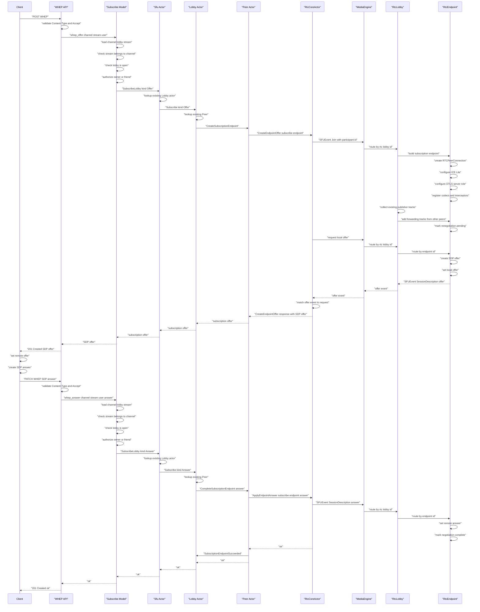

# Create Subscription Endpoint

This use case documents a participant creating a subscription endpoint with WHEP
so it can receive media from the lobby. The lobby and peer already exist before
this flow starts.

When the subscription endpoint is created, the lobby collects all already
published tracks from other participants and includes them in the initial SFU
offer to the subscriber.

WHEP is a two-step HTTP exchange in Shig:

1. `POST /whep` asks the SFU to create an SDP offer for the subscription endpoint.
2. `PATCH /whep` sends the client's SDP answer back to complete that endpoint.

## Scope

This case covers one participant's first subscription endpoint:

- the `Sfu` already has the lobby actor
- the lobby already has the peer actor
- the peer already has a publish endpoint
- the peer already has a reserved subscribe endpoint ID
- the subscribe endpoint is not negotiated yet
- the request does not create a new logical peer
- existing tracks from other participants are added to the subscription endpoint
  before the SFU offer is returned

## Public Requests

The first request creates the SFU offer:

```http
POST /{channel_uuid}/stream/{stream_uuid}/whep
Content-Type: application/sdp
Accept: application/sdp
```

The successful response contains the SFU offer:

```http
HTTP/1.1 201 Created
Content-Type: application/sdp

v=0
...
```

The second request completes the endpoint:

```http
PATCH /{channel_uuid}/stream/{stream_uuid}/whep
Content-Type: application/sdp
Accept: application/sdp

v=0
...
```

The successful response is:

```http
HTTP/1.1 201 Created
Content-Type: application/sdp

ok
```

## End To End Flow



## Control Plane Messages

The first HTTP request creates the SFU offer:

| Step | Message | Purpose |
| --- | --- | --- |
| 1 | `SubscribeLobby` with `SubscribeKind::Offer` | Enter the SFU with the existing lobby and user. |
| 2 | `Subscribe` with `SubscribeKind::Offer` | Ask the existing lobby to create the peer's subscription offer. |
| 3 | `CreateSubscriptionEndpoint` | Ask the existing peer to create the subscribe endpoint offer. |
| 4 | `CreateEndpointOffer` | Cross from the actor control plane into the endpoint-based RTC media plane. |
| 5 | `SFUEvent::SessionDescription` with offer | Return the generated SDP offer to the waiting `CreateEndpointOffer` request. |

The second HTTP request applies the client answer:

| Step | Message | Purpose |
| --- | --- | --- |
| 1 | `SubscribeLobby` with `SubscribeKind::Answer` | Enter the SFU with the client's SDP answer. |
| 2 | `Subscribe` with `SubscribeKind::Answer` | Route the answer to the existing peer. |
| 3 | `CompleteSubscriptionEndpoint` | Ask the peer to complete its subscribe endpoint. |
| 4 | `ApplyEndpointAnswer` | Apply the answer to the RTC endpoint. |
| 5 | `SubscriptionEndpointSucceeded` | Notify the lobby after the subscribe endpoint has completed negotiation. |

## RTC Events

Inside the RTC core, the offer side is represented by these events and local
operations:

| Event | Direction | Effect |
| --- | --- | --- |
| `SFUEvent::Join` | control plane to `MediaEngine` | Add the subscribe `RtcEndpoint` with its participant ID to the existing `RtcLobby`. |
| collect publisher tracks | lobby internal | Find all existing publish tracks from other peers in the same RTC lobby. |
| add forwarding tracks | lobby to endpoint | Add those tracks to the subscriber endpoint before the initial offer is created. |
| `create_offer` | endpoint internal | Create the SFU offer for the subscription endpoint. |
| `set_local_description` | endpoint internal | Store the offer as the current local negotiation. |
| `SFUEvent::SessionDescription` with offer | endpoint to control plane | Return the SDP offer that becomes the `POST /whep` response body. |

The answer side completes that negotiation:

| Event | Direction | Effect |
| --- | --- | --- |
| `SFUEvent::SessionDescription` with answer | control plane to endpoint | Apply the client's SDP answer. |
| `mark_curr_negotiation_complete` | endpoint internal | Clear the in-flight negotiation and drive deferred renegotiation if needed. |

## Resulting State

After the `PATCH /whep` response has been sent:

- the logical peer has both endpoint IDs active
- the publish endpoint receives this user's local media
- the subscription endpoint is negotiated and can receive forwarded media
- already existing tracks from other participants were offered to this endpoint
- the endpoint is ready for ICE, DTLS, SRTP, RTP, RTCP, and Control DataChannel traffic
- the lobby can reconcile forwarding tracks onto this subscription endpoint

If no other participant is publishing yet, the subscription endpoint can still be
connected but has no remote media to receive. When another publish track appears,
the lobby updates the forwarding graph and the endpoint can be renegotiated over
the Control DataChannel.

## Implementation Note

The actor boundaries already exist as `CreateEndpointOffer` and
`ApplyEndpointAnswer`. The endpoint-based media flow should translate the domain
subscribe `EndpointId` into RTC identifiers, apply `SFUEvent::Join`, return the
first `SFUEvent::SessionDescription` offer as the response to the waiting
`CreateEndpointOffer` command, and use that SDP as the `POST /whep` response
body. Before that offer is created, the RTC lobby should add all existing
publisher tracks from other peers to the subscription endpoint. The client answer
from `PATCH /whep` is then applied as `SFUEvent::SessionDescription`.
